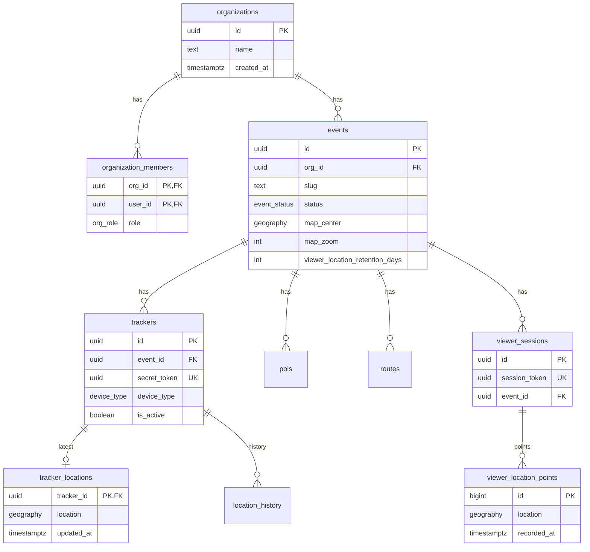

# データベース構成

OpenMATSURI のデータストアは **Supabase（PostgreSQL + PostGIS）** です。マイグレーションは `supabase/migrations/` にあり、`supabase db reset` で適用されます。

型定義の参照先: `packages/realtime/src/database.types.ts`

## 概要

| レイヤ | 内容 |
|--------|------|
| マルチテナント | `organizations` / `organization_members`（Supabase Auth 連携） |
| イベント | `events`（祭り単位の設定・公開状態） |
| トラッカー位置 | `trackers` → `tracker_locations`（最新）/ `location_history`（履歴） |
| 来場者位置 | `viewer_sessions` → `viewer_location_points`（匿名・運営ヒートマップ用） |
| 静的マップ情報 | `pois` / `routes` |

## ER 図



## 拡張機能

| 拡張 | 用途 |
|------|------|
| `postgis` | 位置・ルートの `geography` 型 |
| `pg_cron` | 古い位置履歴の定期削除 |

## Enum 型

| 型名 | 値 | 用途 |
|------|-----|------|
| `event_status` | `draft`, `live`, `archived` | イベント公開状態 |
| `device_type` | `pwa`, `soracom_lte`, `android_agent`, `pi_agent`, `external` | トラッカー端末種別 |
| `poi_kind` | `toilet`, `parking`, `shelter`, `food`, `other` | POI カテゴリ |
| `org_role` | `owner`, `editor`, `viewer` | 運営組織の権限（**アプリ名の Viewer とは別**） |
| `location_source` | `pwa`, `android_agent`, `pi_agent`, `soracom`, `traccar` | 位置履歴の送信元 |

## テーブル

### `organizations`

運営組織（テナント）。

| カラム | 型 | 説明 |
|--------|-----|------|
| `id` | uuid | PK |
| `name` | text | 組織名 |
| `created_at` | timestamptz | 作成日時 |

### `organization_members`

Supabase Auth ユーザーと組織の紐付け。

| カラム | 型 | 説明 |
|--------|-----|------|
| `org_id` | uuid | FK → `organizations` |
| `user_id` | uuid | FK → `auth.users` |
| `role` | `org_role` | `owner` / `editor` / `viewer` |
| `created_at` | timestamptz | 参加日時 |

### `events`

祭りイベント。Viewer の公開対象は `status = 'live'` のみ。

| カラム | 型 | 説明 |
|--------|-----|------|
| `id` | uuid | PK |
| `org_id` | uuid | FK → `organizations` |
| `slug` | text | URL 用スラッグ（組織内で一意） |
| `name` | text | イベント名 |
| `description` | text | 説明（任意） |
| `starts_at` / `ends_at` | timestamptz | 開催期間（任意） |
| `status` | `event_status` | 公開状態 |
| `map_center` | geography(Point, 4326) | Viewer 初期表示の中心 |
| `map_zoom` | integer | Viewer 初期ズーム（デフォルト 14） |
| `viewer_location_retention_days` | integer | 来場者位置の保持日数（デフォルト 365） |
| `created_at` | timestamptz | 作成日時 |

### `trackers`

山車・神輿など位置を発信する端末。

| カラム | 型 | 説明 |
|--------|-----|------|
| `id` | uuid | PK |
| `event_id` | uuid | FK → `events` |
| `name` | text | 表示名 |
| `secret_token` | uuid | Tracker PWA 用トークン（URL `/t/{token}`） |
| `device_type` | `device_type` | 端末種別 |
| `soracom_sim_id` | text | SORACOM SIM ID（任意・一意） |
| `is_active` | boolean | 無効化すると ingest 拒否 |
| `last_seen_at` | timestamptz | 最終受信時刻 |
| `icon_color` など | | マップ表示用メタ情報 |

### `tracker_locations`

**各トラッカーの最新位置**（1 トラッカー 1 行）。Viewer / Admin がリアルタイム購読。

| カラム | 型 | 説明 |
|--------|-----|------|
| `tracker_id` | uuid | PK, FK → `trackers` |
| `event_id` | uuid | FK → `events`（トリガーで同期） |
| `location` | geography(Point, 4326) | 現在位置 |
| `heading` / `speed` / `accuracy` | double | 方位・速度・精度（任意） |
| `updated_at` | timestamptz | 最終更新 |

> アプリでは `updated_at` が直近 120 秒以内のトラッカーのみ「受信中」としてマップに表示します。行が残っていても古い位置は非表示になります。

### `location_history`

トラッカー位置の履歴。**運営（org メンバー）のみ参照可**。

| カラム | 型 | 説明 |
|--------|-----|------|
| `id` | bigserial | PK |
| `tracker_id` | uuid | FK → `trackers` |
| `event_id` | uuid | FK → `events` |
| `location` | geography(Point, 4326) | 位置 |
| `source` | `location_source` | 送信元 |
| `recorded_at` | timestamptz | 記録時刻 |

### `pois`

トイレ・駐車場などの施設。

| カラム | 型 | 説明 |
|--------|-----|------|
| `id` | uuid | PK |
| `event_id` | uuid | FK → `events` |
| `name` | text | 名称 |
| `kind` | `poi_kind` | カテゴリ |
| `location` | geography(Point, 4326) | 位置 |

### `routes`

コース（線）。

| カラム | 型 | 説明 |
|--------|-----|------|
| `id` | uuid | PK |
| `event_id` | uuid | FK → `events` |
| `name` | text | コース名 |
| `path` | geography(LineString, 4326) | 経路 |
| `is_visible` | boolean | Viewer に表示するか |

### `viewer_sessions`

来場者の匿名セッション。個人特定はしない。

| カラム | 型 | 説明 |
|--------|-----|------|
| `id` | uuid | PK |
| `event_id` | uuid | FK → `events` |
| `session_token` | uuid | 端末 `localStorage` に保存する匿名トークン |
| `consented_at` | timestamptz | 同意日時 |
| `last_seen_at` | timestamptz | 最終アクセス |

### `viewer_location_points`

来場者位置のポイント履歴。**運営ヒートマップ用**。他の来場者には公開しない。

| カラム | 型 | 説明 |
|--------|-----|------|
| `id` | bigserial | PK |
| `session_id` | uuid | FK → `viewer_sessions` |
| `event_id` | uuid | FK → `events` |
| `location` | geography(Point, 4326) | おおよその位置 |
| `accuracy` | double | GPS 精度（任意） |
| `recorded_at` | timestamptz | 記録時刻 |

送信間隔は Viewer 側で **2 分ごと**。同意画面で明示同意が必要。

## 位置データの形式

PostGIS `geography` 列は、REST API 経由では **EWKB 十六進文字列** として返ることが多いです。

```
0101000020E6100000...
```

アプリ側では `parseGeoPoint()`（`packages/realtime/src/geo.ts`）で `[lng, lat]` に変換します。DB への INSERT は `toGeographyEwkt(lng, lat)`（`packages/config`）を使用します。

## RPC（ストアド関数）

| 関数 | 呼び出し元 | 説明 |
|------|-----------|------|
| `upsert_location(...)` | Edge `ingest-location`（service role） | トラッカー位置の upsert + 履歴追記 |
| `ingest_viewer_location(...)` | Edge `ingest-viewer-location` | 来場者位置の追記 |
| `resolve_tracker_by_token(uuid)` | Edge Function | トークン → tracker_id |
| `resolve_tracker_by_sim(text)` | Edge `ingest-soracom` | SIM ID → tracker_id |
| `get_tracker_public_info(uuid)` | Tracker PWA | トークンから名前取得 |
| `is_org_member(...)` | RLS 内部 | 組織メンバー判定 |
| `is_live_event(uuid)` | ingest 内部 | 公開中イベント判定 |
| `cleanup_old_location_history()` | pg_cron（毎日 3:00） | 終了後 30 日経過したトラッカー履歴を削除 |
| `cleanup_old_viewer_locations()` | pg_cron（毎日 4:00） | `viewer_location_retention_days` を超えた来場者位置を削除 |

## Edge Functions

| 関数 | エンドポイント | 用途 |
|------|---------------|------|
| `ingest-location` | `POST /functions/v1/ingest-location` | Tracker PWA からの位置 |
| `ingest-soracom` | `POST /functions/v1/ingest-soracom` | SORACOM からの位置 |
| `ingest-viewer-location` | `POST /functions/v1/ingest-viewer-location` | Viewer からの匿名位置 |

ローカル起動:

```bash
supabase functions serve ingest-location ingest-soracom ingest-viewer-location --env-file .env.example
```

## データの流れ

### トラッカー位置

```
Tracker PWA / SORACOM
  → Edge Function (ingest-location / ingest-soracom)
    → RPC upsert_location
      → tracker_locations（最新）
      → location_history（履歴）
  → Supabase Realtime（postgres_changes on tracker_locations）
    → Viewer / Admin マップ
```

### 来場者位置

```
Viewer（同意 + GPS 許可、2 分間隔）
  → Edge Function ingest-viewer-location
    → RPC ingest_viewer_location
      → viewer_sessions（初回のみ作成）
      → viewer_location_points
  → Admin（認証済み・org メンバー）
    → viewer_location_points を SELECT
    → ヒートマップ表示（トグル ON 時）
```

来場者同士の位置共有はありません。

## RLS（行レベルセキュリティ）概要

| テーブル | 匿名（anon） | 認証済み運営 | 備考 |
|----------|-------------|-------------|------|
| `events` | `live` のみ SELECT | org メンバーは CRUD | |
| `trackers` | `live` イベントのみ SELECT | org メンバーは CRUD | |
| `tracker_locations` | `live` イベントのみ SELECT | 同上 | |
| `pois` / `routes` | `live` + 表示可のみ SELECT | org メンバーは CRUD | |
| `location_history` | 不可 | org メンバーのみ SELECT | |
| `viewer_sessions` | 不可 | org メンバーのみ SELECT | INSERT は RPC 経由 |
| `viewer_location_points` | 不可 | org メンバーのみ SELECT | INSERT は RPC 経由 |
| `organizations` | 不可 | メンバーのみ | |

位置の **INSERT** は原則 Edge Function（service role）→ `security definer` RPC 経由で行い、クライアントから直接書き込みません。

## Realtime

`supabase_realtime` パブリケーションに含まれるテーブル:

- `tracker_locations` — トラッカー位置のライブ更新
- `pois` — POI の追加・変更（マイグレーション `20250613120000_pois_realtime.sql`）

環境変数 `NEXT_PUBLIC_REALTIME_MODE=broadcast` の場合、Edge Function からブロードキャストも併用します。

## マイグレーション一覧

| ファイル | 内容 |
|----------|------|
| `20250612000000_initial_schema.sql` | 初期スキーマ・PostGIS・RLS・トラッカー ingest |
| `20250612000001_grants.sql` | トラッカー公開情報 RPC |
| `20250612000002_org_bootstrap.sql` | 組織参加ポリシー |
| `20250612000003_tracker_crud_policies.sql` | トラッカー CRUD ポリシー |
| `20250612120000_fix_location_server_timestamps.sql` | 位置タイムスタンプ修正 |
| `20250613120000_pois_realtime.sql` | POI の Realtime 公開 |
| `20250613140000_viewer_locations.sql` | 来場者匿名位置・ヒートマップ用 |

## 関連ドキュメント

- [SORACOM GPS 設定](./soracom-setup.md)
- [README（クイックスタート）](../README.md)
